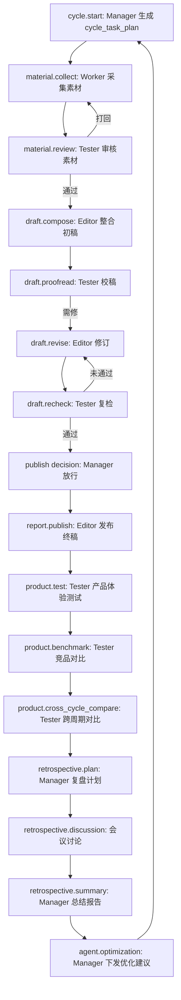

# Newsflow 工作流过程文档（与平台无关）

> 目的：描述“server + manager 推进”的完整工作流过程与设计逻辑，不包含任何平台适配、机器可读字段或实现细节。

## 1. 设计目标与原则

**目标**
- 产出可发布的新闻产品，并完成测试与复盘闭环。
- 让协作流程为“任务目标”服务，而不是为“流程通过”服务。

**核心原则**
- **分层**：流程控制与内容产出分离。控制层只决定“下一步”，内容层只输出“真实内容”。
- **角色清晰**：manager 负责拆解任务、分配、验收、推进；执行 agent 只对 manager 的阶段目标负责。
- **证据驱动**：所有关键决策都基于阶段产出与证据，不凭空填充。
- **最小约束**：限制只针对“目标与质量”，不约束具体文案或格式。

## 2. 角色与职责边界

**Server（调度中心）**
- 维护流程状态机。
- 只与 manager 交互（隐形通道）。
- 接收“是否进入下一步”的信号。

**Manager（主持与调度）**
- 生成本轮 cycle 目标拆解（cycle_task_plan）。
- 对每个阶段下发目标、标准和注意点。
- 收敛验收后决定 proceed / redo / pause / forced proceed。

**Editor**
- 整合素材，产出草稿、修订稿、终稿。
- 对结构完整性与字段齐全负责。

**Worker（多个）**
- 负责各自板块素材采集与提交。
- 对素材质量与覆盖负责。

**Tester**
- 负责审核与测试，不负责内容产出。
- 提供问题与依据，不做决策推进。

## 3. 工作流总览（流程图）

> 说明：每个阶段都允许 **redo**（重做）与 **pause**（暂停）。强制推进（forced proceed）只能由 manager 触发。

## 4. 阶段详解

### 4.1 cycle.start
- **输入**：上一轮优化建议、历史问题、外部目标。
- **输出**：本轮任务拆解（cycle_task_plan）。
- **Manager 任务**：明确“完成”的定义、优先级、板块要求、最小验收标准。
- **防呆**：计划必须覆盖所有板块与最低产出要求。

### 4.2 material.collect
- **输入**：manager 的板块要求。
- **输出**：候选素材池（逐条素材）。
- **Worker 任务**：采集素材，不做主推判断。
- **防呆**：缺图/重复/偏题需显式标注问题。

### 4.3 material.review
- **输入**：候选素材池。
- **输出**：通过/驳回意见与理由。
- **Tester 任务**：逐条审核，给出证据与判断依据。
- **纠错**：驳回后返回采集阶段，重复采集。

### 4.4 draft.compose
- **输入**：通过的素材池。
- **输出**：初稿。
- **Editor 任务**：完成结构落地（主推/副推/简讯）。
- **防呆**：结构不完整、字段缺失视为不合格。

### 4.5 draft.proofread → revise → recheck
- **输入**：初稿。
- **输出**：校稿问题、修订稿、复检结论。
- **Tester 任务**：指出问题并给证据，不决定推进。
- **Editor 任务**：修订到满足问题要求。
- **纠错**：重复直到问题清零或 manager 判定 forced proceed。

### 4.6 publish decision → report.publish
- **Manager 任务**：决定是否发布。
- **Editor 任务**：输出正式终稿。
- **防呆**：发布必须有正式交付物。

### 4.7 product.test / benchmark / cross_cycle_compare
- **Tester 任务**：从读者体验角度评估、竞品对比、跨周期对比。
- **输出**：产品问题与改善建议，不做责任分派。

### 4.8 retrospective
#### plan
基于 tester 报告 + 执行结果输出复盘计划。

#### discussion（会议）
- **议题驱动**，由 manager 提出议题。
- 其他 agent 参与讨论，围绕证据展开。
- manager 控制节奏并收口。

#### summary
输出正式复盘总结、接受/拒绝建议、责任与下一轮要求。

#### optimization
对每个 agent 下发下一轮的针对性优化建议。

## 5. 推进逻辑与责任

**推进信号**
- 只有 manager 能向 server 发出“进入下一步”的信号。
- Tester / Editor / Worker 只能给出建议与依据。

**循环机制**
- 任何阶段发现不满足最低要求 → manager 发 redo。
- redo 可跨多轮，但应设置“强制推进”上限。

## 6. 防呆机制与纠错机制

**防呆**
1) 所有阶段都有最小验收要求，达不到就 redo。  
2) 结构完整性优先（有内容但缺结构 = 不合格）。  
3) 控制层信息不得进入对外展示。  

**纠错**
1) redo：重新执行同阶段任务。  
2) partial pass：部分通过，进入修订或补充流程。  
3) forced proceed：多次重做后仍未达标，由 manager 强制推进，并在复盘中记录风险。  

## 7. 会议规则（轻量约束）
- 会议以议题为中心，不以轮次为中心。  
- manager 主持并决定谁需要回应。  
- 讨论必须引用证据与具体对象。  
- 到时间立即收口，避免无尽争论。  

## 8. 输出与闭环
- 每轮必须有：终稿、测试报告、复盘计划、复盘总结、优化建议。
- 优化建议必须进入下一轮 cycle.start 作为输入。

